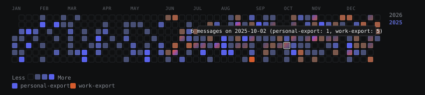

# claude-recap

> Turn your official Claude.ai data export into a personal, "wrapped"-style usage dashboard — entirely in your browser.

**⚠️ Unofficial, community project.** Not affiliated with, endorsed by, or sponsored by Anthropic. "Claude" is a trademark of Anthropic PBC, used here only to describe compatibility.

**🔗 Live demo: [mckcieply.github.io/claude-recap](https://mckcieply.github.io/claude-recap/)** — no export handy? Click "Try it with sample data" on the page. See [Privacy](#privacy--read-this-before-uploading-anything) for how to verify the hosted build yourself.

---



*Synthetic demo data, not a real account — see [Privacy](#privacy--read-this-before-uploading-anything). Static export; the live app's heatmap is interactive (hover for exact counts, click a year to switch).*

## What is this?

Claude.ai doesn't expose a public API for personal historical usage stats — no "how many messages have I sent since 2024" endpoint. What it *does* offer is a manual data export (Settings → Privacy → Export data) containing your full conversation history.

**claude-recap** reads that export and turns it into a visual summary of your usage — similar in spirit to Spotify Wrapped or a GitHub contribution graph: how long you've been using Claude, your activity over time, streaks, busiest hours, and more.

## Why this stack

Everything here follows from one constraint: **your data never leaves your browser.** No backend, no upload, works fully offline once the page has loaded. That single rule drives most of the technical choices below — zoneless Angular with signals instead of a server-rendered framework, hand-rolled SVG instead of a charting library with its own data-fetching assumptions, and a native DOM→SVG→canvas export pipeline instead of a screenshot library, so that turning a stat card into a shareable PNG never has to leave the page either. See [Tech stack](#tech-stack) for the full breakdown.

## Features

- 📅 **Timeline** — date of your first conversation, total days active
- 🔥 **Activity heatmap** — daily message activity, GitHub-contribution-graph style, with a year picker
- 🌙 **Patterns** — busiest day of week, busiest hour, longest streak
- 💬 **Counts** — total conversations, messages, words
- 📈 **Approximate token estimate** *(see caveat below — not exact)*
- 🧵 **Highlights** — longest conversation, most active month, most active year
- 🖼️ **Widget export** — save any individual stat card (heatmap, streak, top stats, etc.) as a standalone PNG or SVG image — like Spotify Wrapped's individual share slides
- 🗂️ **Multiple exports at once** — drop in more than one `conversations.json` (e.g. a personal account and a work account) and see them together on one dashboard. Each of the first 3 sources gets its own identity color, shaded against *its own* activity range rather than a shared scale, so a light-use account still shows visible highs and lows instead of reading as uniformly faint next to a heavier one. The activity heatmap blends per-day where two sources overlap (a diagonal gradient between their colors) and marks a third overlapping source with a small corner swatch. A 4th+ source still counts fully toward the combined totals and heatmap, just without its own color.

## How it works

```
export data (.json, 1+ files)  →  drop in browser  →  parsed & rendered locally  →  browse dashboard  →  export any widget as an image
```

Nothing here is a live feed — it's a one-time (or whenever-you-want) pass over a static export file. There's no account, no login, no backend to talk to. The whole thing could run from a single HTML file with no internet connection at all, and that's intentional (see [Privacy](#privacy--read-this-before-uploading-anything)).

**Widget export**, specifically: every card in the dashboard is a self-contained visual unit. Each one gets an export control that clones the card, inlines its computed styles, and serializes it to a standalone SVG (offered directly, or rasterized to a PNG via an in-memory canvas) — no `html-to-image`/`html2canvas`, no server round-trip, nothing uploaded anywhere.

## Privacy — read this before uploading anything

Your export contains the full text of every conversation you've ever had with Claude — for most people that includes sensitive personal, professional, and financial information. This tool is built around one rule:

**Your data never leaves your browser.**

- 100% client-side — parsing and rendering happen locally, nothing is sent to any server
- No analytics, no error-tracking SDKs, no third-party scripts that touch your file's contents
- Works fully offline once the page is loaded — disconnect from the internet before uploading if you want to verify this yourself
- Fully open source — audit the code and your browser's network tab any time

If a hosted version of this tool exists, treat it the same as running it locally: check the network tab, or just run it from source.

**The hosted build at [mckcieply.github.io/claude-recap](https://mckcieply.github.io/claude-recap/) has been verified this way** — open your browser's network tab, load the page, then disconnect from the internet entirely and drop a `conversations.json` in. It still renders the full dashboard, because nothing after the initial page load ever leaves (or reaches) your browser. Repeat the check yourself any time; it should hold on every deploy, not just this one.

## Getting started

No export yet? Click **"Try it with sample data"** on the [live demo](https://mckcieply.github.io/claude-recap/) to explore a full dashboard built from a synthetic, made-up dataset — or download it directly: [`sample-data/conversations.json`](public/sample-data/conversations.json).

1. **Export your data**: claude.ai → profile icon → Settings → Privacy → **Export data**. Anthropic emails you a download link (valid ~24h).
2. **Unzip the archive** — you'll get a `conversations.json` (and possibly other files; only `conversations.json` is used).
3. Open the tool and drop `conversations.json` in — drop more than one (e.g. from a second account) to see them together, each in its own color.
4. Browse your stats.

### Running locally

```bash
git clone https://github.com/MckCieply/claude-recap.git
cd claude-recap
npm install
npm start
```

Opens a dev server (Angular CLI, `ng serve`) at `http://localhost:4200`.

## Limitations

- **Token counts are an estimate.** Claude's exact tokenizer isn't public, so figures are heuristic (word count × 1.3) and may differ from your real usage.
- **Projects and memory** are inconsistently included (or excluded) in the standard export — stats derived from conversations tied to a Project may be partial.
- **This is a snapshot, not a live feed.** Re-export your data any time you want fresh stats; there's no way to auto-sync.
- Very long conversations occasionally have incomplete data in Anthropic's own export (a known limitation on their end).
- **Distinct per-file colors are capped at 3 imports.** A 4th+ file is still counted in the combined totals and heatmap, just rendered in a neutral fallback color instead of its own hue.

## Tech stack

Hard constraints any choice had to satisfy, driven by the [Privacy](#privacy--read-this-before-uploading-anything) promise and the widget-export feature: no backend or server calls, must work fully offline once loaded, must run entirely in-browser on a user-supplied JSON file that could be large, and needs a reliable way to render a single UI card to a downloadable PNG/SVG.

| Layer | Decision | Notes |
|---|---|---|
| Framework | **Angular v22**, standalone components, zoneless (no Zone.js — removed by default in v22) | Chosen for existing team experience; `--routing=false`, single view with internal state, no SSR |
| Language | **TypeScript**, strict mode | |
| State | **Signals** (`signal()`/`computed()`/`linkedSignal()`) | Angular's current default state model, not RxJS-for-everything |
| Charts / heatmap / stat tiles | Hand-rolled SVG | Per the vendored `dataviz` skill (see [CLAUDE.md](CLAUDE.md)) — no charting library pulled in |
| Widget → image export | Native DOM-to-SVG export (clone + inline computed styles + `<foreignObject>`), rasterized to PNG via canvas when needed | No `html-to-image`/`html2canvas` — avoids a second render path |
| Styling | Angular component styles, SCSS, view encapsulation (scoped) | Follows the locked design direction in [.claude/DESIGN_DIRECTION.md](.claude/DESIGN_DIRECTION.md) (reference brand: Linear's marketing site) |
| Accessibility | WCAG AA target, AXE-audited | The heatmap's year picker and per-day cells, and the file-drop zone's live import status, are keyboard-navigable and screen-reader labeled (`role`/`aria-*`), not just visually styled |
| Testing | Vitest | Angular CLI's current default test runner |
| Build | `@angular/build` (esbuild-based `application` builder) | Angular CLI default since v17; Webpack path is deprecated as of v22 |
| Hosting | **GitHub Pages** — deployed by [`.github/workflows/deploy-pages.yml`](.github/workflows/deploy-pages.yml) on every push to `main` | Purely static output; also works from Netlify, Vercel static, or just the built `dist/` opened locally — "hosted version" in the Privacy section refers to whichever one you're looking at |

Full Angular coding conventions for this repo (signals-first, `input()`/`output()`/`model()`, Signal Forms, a11y bar, etc.) live in [CLAUDE.md](CLAUDE.md), generated from Angular's own current best-practice list via `ng new --ai-config=claude-code`.

## Contributing

Issues and PRs welcome. Please **do not** attach real export data (yours or anyone else's) to issues, screenshots, or test fixtures — use synthetic/sample data only.

## License

[GNU Affero General Public License v3.0](LICENSE) (AGPL-3.0).
